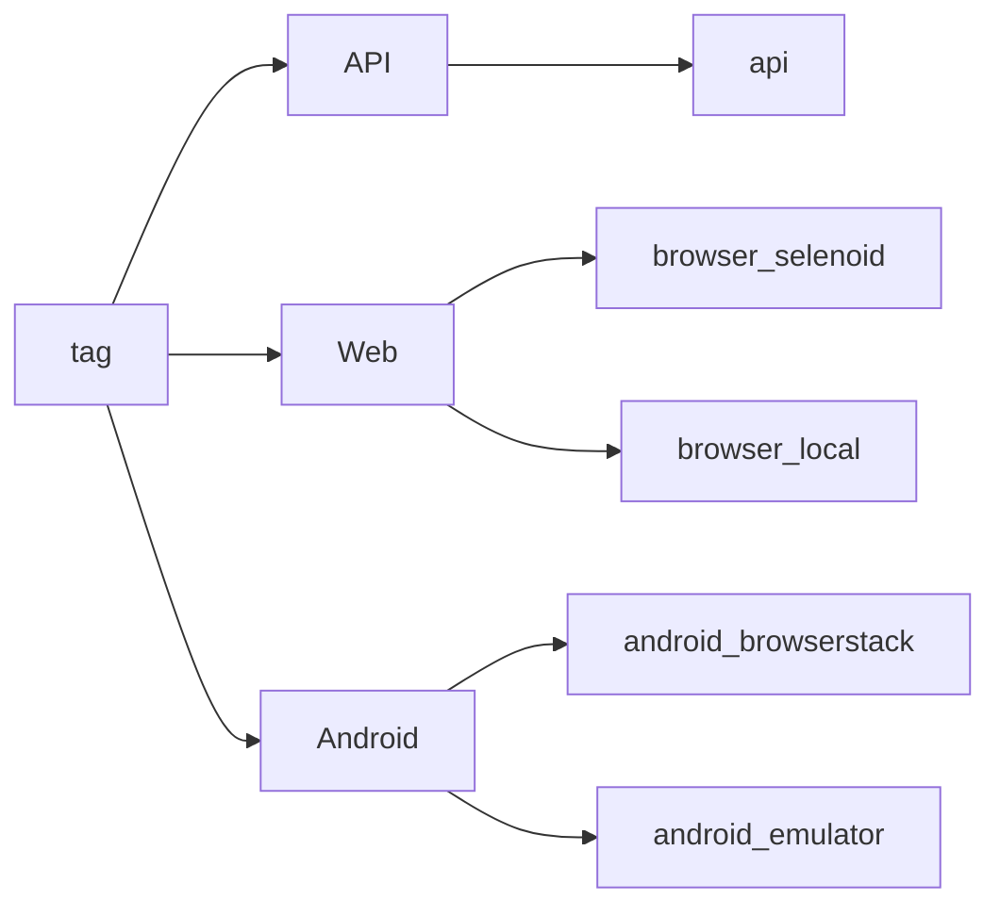
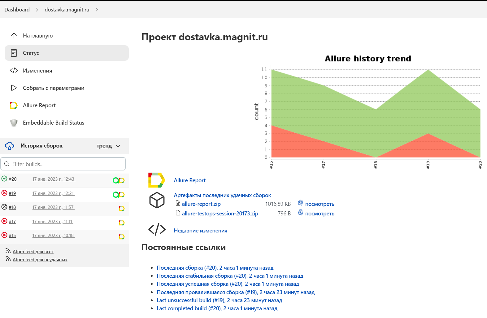

<h2 align="center"> Проект по автоматизации тестирования для компании "Магнит Доставка" </h2>
<a href="https://rabota.sber.ru"></a>

# <a name="Содержание">Содержание</a>
+ [Описание](#Описание)
+ [Технологии и инструменты](#Технологии-и-инструменты)
+ [Варианты запуска](#Варианты-запуска)
    + [Gradle command](#GradleCommand)
    + [Запуск в Jenkins](#RunInJenkins)
+ [Telegram уведомления](#TelegramNotifications)
+ [Результаты тестов в Allure Report](#AllureReport)
+ [Интеграция с Allure TestOps](#AllureTestOps)
+ [Интеграция с Jira](#Jira)
+ [Видео запуска тестов](#Video)


# <a name="Описание">Описание</a>
Тестовый проект состоит из веб-тестов (UI), тестов API и мобильных тестов (Android).\
Краткий список интересных фактов о проекте:
- [x] `Page Object` проектирование
- [x] Параметризованные тесты
- [x] Различные файлы конфигурации для запуска теста в зависимости от параметров сборки
- [x] Конфигурация с библиотекой `Owner`
- [x] Использование `Lombok` для моделей в API тестах
- [x] Objects serialization/deserialization for API requests/responses using `Jackson`
- [x] Использование request/response спецификаций для API тестов
- [x] Custom Allure listener для API requests/responses логов
- [x] Интеграция с `Allure TestOps`
- [x] Autotests as test documentation
- [x] Интеграция с `Jira`


# <a name="Технологии и инструменты">Технологии и инструменты</a>
<p  align="center">
  <code></code>
  <code></code>
  <code></code>
  <code></code>
  <code></code>
  <code></code>
  <code></code>
  <code></code>
  <code></code>
  <code></code>
  <code></code>
  <code></code>
  <code></code>
  <code></code>
  <code></code>
  <code></code>
</p>

Автотесты в этом проекте написаны на `Java` использую `Selenide` фреймворк.\
`Gradle` - используется как инструмент автоматизации сборки.  \
`JUnit5` - для выполнения тестов.\
`REST Assured` - для тестирования REST-API сервисов.\
`Jenkins` - CI/CD для запуска тестов удаленно.\
`Selenoid` - для удаленного запуска браузера в `Docker` контейнерах.\
`Browserstack` - для запуска мобильных тестов удаленно.\
`Android Studio tools`, `Appium` - для запуска мобильных тестов локально на эмуляторе мобильных устройств.\
`Allure Report` - для визуализации результатов тестирования.\
`Telegram Bot` - для уведомлений о результатах тестирования.\
`Allure TestOps` - как система управления тестированием.

[Вернуться к оглавлению ⬆](#Содержание)

# <a name="Варианты запуска">Варианты запуска</a>

## <a name="GradleCommand">Команды для Gradle</a>
Для запуска локально и в Jenkins используется следующая команда::
```bash
gradle clean test -Dtag=<tag> -DrunIn=<runIn>
```
Дополнительные параметры:
> `-Dselenoid_user_sys_prop=enter_user` `-Dselenoid_key_sys_prop=enter_key` - данные для selenoid\
> `-Dbrowserstack_user_sys_prop=enter_user` `-Dbrowserstack_key_sys_prop=enter_key` - данные для browserstack\
> `-DapiBaseUrl=url` можно добавить для установки базового URL-адреса для тестов API.

`tag` - теги для запуска выполнения тестов:
>- *API*
>- *Web*
>- *Android*
 
`runIn` - определяет среду для запуска этих тестов:
>- *api* - for api tests
>- *browser_selenoid*
>- *browser_local*
>- *android_browserstack*
>- *android_emulator*

Дополнительные свойства извлекаются из соответствующего файла конфигурации (в зависимости от значения `runIn`):
```bash
./resources/config/${runIn}.properties
```

Допустимые комбинации:


[Вернуться к оглавлению ⬆](#Содержание)

## <a name="RunInJenkins">Запуск в [Jenkins](https://jenkins.autotests.cloud/job/dostavka.magnit.ru/)</a>
Главная страница сборки:
<p  align="center">

</p>

Параметризованное задание Jenkins может быть запущено с необходимыми ***tag*** and ***runIn***:
<p  align="center">

</p>

Конфиденциальная информация (имена для входа и пароли) хранится в зашифрованном виде в хранилище учетных данных Jenkins.\
И относительно безопасно передается в сборку аргументами gradle, а его значения маскируются в логах.

После завершения сборки результаты тестирования доступны в:
>- <code><strong>*Allure Report*</strong></code>
>- <code><strong>*Allure TestOps*</strong></code> - результаты загружаются туда и тест-кейсы могут автоматически обновляться в соответствии с последними изменениями в коде.

<p  align="center">

</p>

[Вернуться к оглавлению ⬆](#Содержание)
